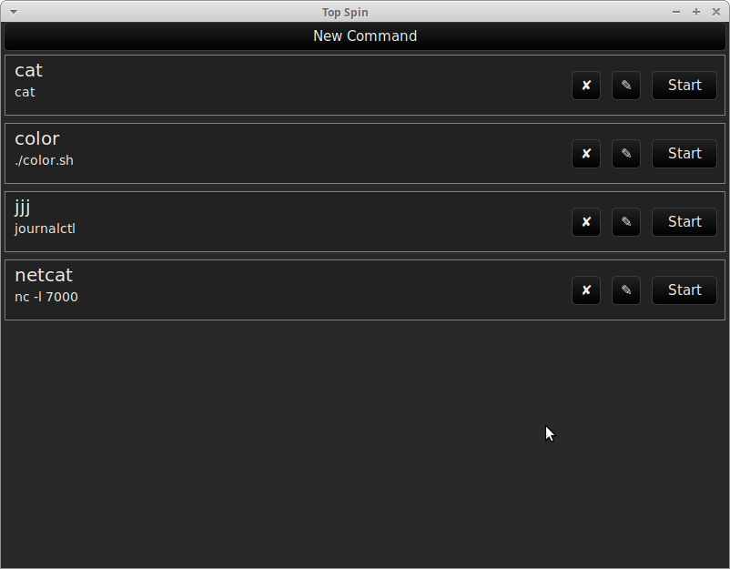

# Top Spin

A simple GUI application for launching (long-running) shell commands. It stores a list of CLI program commands and run them in background with a click. This is useful for quickly start/stop devservers on localhost (such as running `npm start`). Built with [druid](https://crates.io/crates/druid).



## Config

A config file is read from `~/.config/topspin.toml` or file specified by `TOPSPIN_CONFIG` environment variable. Example:

```toml
[commands.cat]
command = "cat"

[commands.netcat]
command = "nc"
args ="-l 7000"
working_dir = "~/"
```

## Stream Outputs

Stdout / stderr outputs can be streamed (over TCP) by connecting to a running GUI instance:

```bash
# -c <command alias>
topspin -c netcat
```

